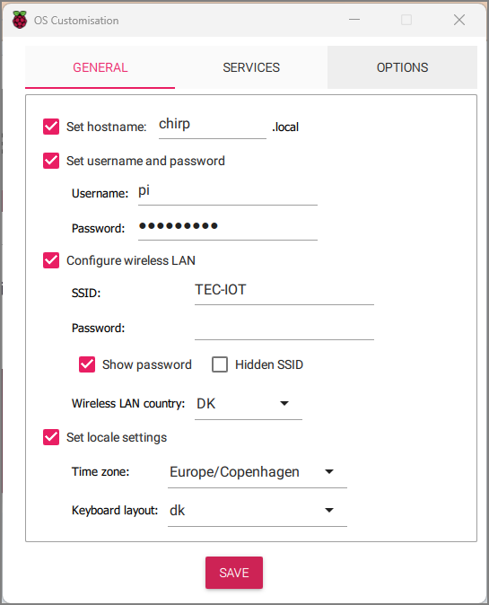
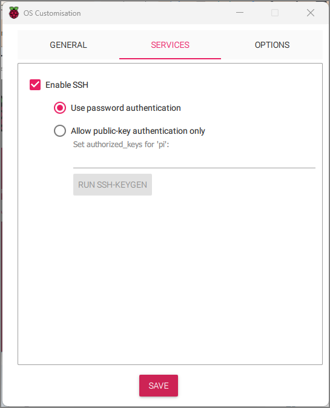

# Docker compose variant

## 0. TEC-IOT WiFi

Jeg kobler alle enheder, og min pc op på WiFi-accespointet `TEC-IOT`. Det kan vi styre muligheder og begrænsninger, uden at vente på sagsbehandling fra ITCN.

SSID
: TEC-IOT

pw
: 42090793

### 0.1 Admin login

<http://192.168.0.1>

~~user~~
~~: admin~~

pw
: 7ellowsTon3


## 1. Raspberry Pi image

Benyt imager <https://www.raspberrypi.com/software/>



Hostname
:   chirp.local

User
:   pi

passwd
: raspberry

SSID
: TEC-IOT

pw
: 42090793

Wireless LAN Country 
: DK



Enable SSH
:  [x] _Use password auth..._

### 1.1 `ssh` til pi'en

Med din pc på `TEC-IOT`;

I powershell eller noget efter egetvalg;
Brug bruger `pi`, og hostnavnet `chirp.local`

    ssh pi@chirp.local

Sig `yes` til at oprette fingerprint

og vi er inde!

    pi@chirp:~ $ 

## 2.1 Kør chirpstack som docker compose stack

### 2.1.1 Docker på Raspberry pi

Det er lidt besværligt fordi vi _ikke_ bare kan installere desktop udgaven.

Jeg følger vejledningen på <https://docs.docker.com/engine/install/raspberry-pi-os/>, og nogle af trinene på <https://docs.docker.com/engine/install/linux-postinstall/>

Som altid først: 

    sudo apt -y update
    sudo apt -y upgrade

Der efter vælger jeg at installere med apt metoden, fordi den er lettest at vedligeholde.
<https://docs.docker.com/engine/install/raspberry-pi-os/#install-using-the-repository> (samme side som ovenfor, men til bogmærket `install-using-the-repository`).  

Først skal dockers repo installeres, dvs tilføjes til apt's pakkeliste system.

Det er nok bedst at kopiere en linje over ad gangen... husk at nogel linjer autowrappes, men skal udvføres som een

```bash
# Add Docker's official GPG key:
sudo apt-get update
sudo apt-get install ca-certificates curl gnupg
sudo install -m 0755 -d /etc/apt/keyrings
curl -fsSL https://download.docker.com/linux/raspbian/gpg | sudo gpg --dearmor -o /etc/apt/keyrings/docker.gpg
sudo chmod a+r /etc/apt/keyrings/docker.gpg

# Set up Docker's APT repository:
echo \
  "deb [arch="$(dpkg --print-architecture)" signed-by=/etc/apt/keyrings/docker.gpg] https://download.docker.com/linux/raspbian \
  "$(. /etc/os-release && echo "$VERSION_CODENAME")" stable" | \
  sudo tee /etc/apt/sources.list.d/docker.list > /dev/null
sudo apt-get update
```

og så selve installationen, med _alle_ pakkerne:

```bash
sudo apt-get install docker-ce docker-ce-cli containerd.io docker-buildx-plugin docker-compose-plugin
```

Check installationen:

    sudo docker run hello-world

I mellem meget andet skulle du gerne se:

    Hello from Docker!
    This message shows that your installation appears to be working correctly.

Så __virker__ det!

Nu skulle det være muligt at opgradere docker med `sudo apt upgrade`. Kan jeg ikke lige teste, da det jo allerede er nyeste version...

#### 2.1.1.1 Docker skal kunne køres af ikke-root brugere

Se <https://docs.docker.com/engine/install/linux-postinstall/> og bemærk advarslerne.

Oprette en gruppe af docker brugere

    sudo groupadd docker

Oups: den findes allerede:

    groupadd: group 'docker' already exists

tilføj mig selv (her `pi`) til gruppen

    sudo usermod -aG docker $USER

(eksekverer uden output...) "intet nyt er godt nyt"

Exit ud af `ssh`forbindelsen, og login igen

test helloworld, uden sudo

    docker run hello-world


#### 2.2.1.2 Docker som service

Enable:

    sudo systemctl enable docker.service
    sudo systemctl enable containerd.service

Disable:

    sudo systemctl disable docker.service
    sudo systemctl disable containerd.service


Jeg tror det var det... med docker installation

## 2.2 Chirpstack docker-compose 


Der er en "officiel" demo af chirpstack med docker-compose, på github. 

<https://www.chirpstack.io/project/guides/docker-compose/>
<https://github.com/chirpstack/chirpstack-docker>

Den henter jeg... så nu ligger den direkte under `pi`'s home mappe (det skal måske ikke være sådan...)

    git clone https://github.com/brocaar/chirpstack-docker.git
    cd chirpstack-docker

Start

    docker compose up

__Bemærk__: uden bindestreg mellem `docker` og `compose`. Nyt i docker.

Man kunne og starte som deamon med `-d`

Den svarer nu på `chirp.local:8080`

user
: admin

pw
: admin

Jeg importerer også lige lorawan devices fra TheThingsNetwork.

    make import-lorawan-devices

## 2.3 Forbind kerlink gateway til chirpstack

Web http://klk-wifc-09163C/

Vi laver en ssh forbindelse til kerlink gateway'en (Virnet iFemtoCell).

Se: https://wikikerlink.fr/wirnet-productline/doku.php?id=wiki:ifemtocell:connect_ifemto

user
: root

pw
: pdmk-$serialno,

hvor $serialno er de sidste 6 cifre i board-id. Her `09163C`

Den konkrete gateway har boardid `3909163C` hostnavnet `klk-wifc-09163C`, så passworded er `pdmk-09163C`

    ssh root@klk-wifc-09163C

password: `pdmk-09163C`

### 2.3.1 Rediger conf

    vim /etc/chirpstack-mqtt-forwarder/chirpstack-mqtt-forwarder.toml

find under `[mqtt]`, `server`
og set
```conf
#  server="tcp://127.0.0.1:1883"
  server="tcp://192.168.0.199:1883"
```

Nu sender Kerlink gatewayen, pakker til ChirpStack'en, via mqtt.

Se gerne log (på Kerlink gateway'en) med:

    tail -f -n 100 /var/log/messages |grep chirpstack-mqtt-forwarder

